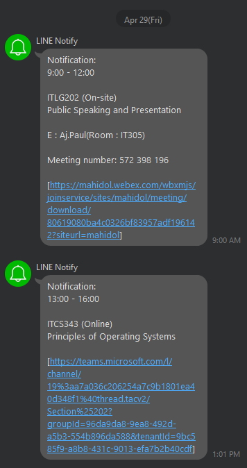
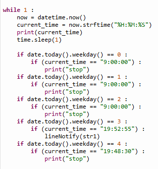
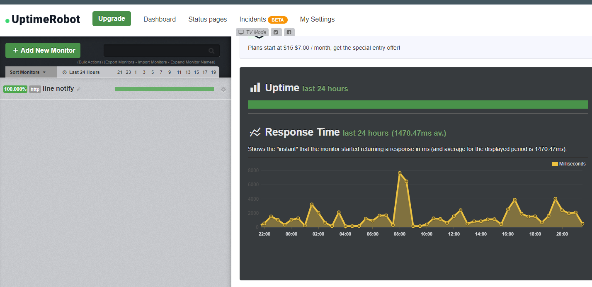

<h1>Line Notify Python Bot</h1>

 This Line notify bot will send the message to your Line group chat using the tokens that is generate in https://notify-bot.line.me/my/

</img>

 to use this Bot you need to install these python package : 
pip3 i datetime  
pip3 i time  
pip3 i pytz  
pip3 i flask   
pip3 i threading   

 In order to make it notify like the schedule that you like you will need to edit the python code 

</img>

 to make your python code run 24/7 you need to launch it at (https://replit.com/) and monitor it using the monitor website example postman or uptimerobot

</img>

monitor : 
https://uptimerobot.com/dashboard#mainDashboard

line notify :
https://notify-bot.line.me/my/
